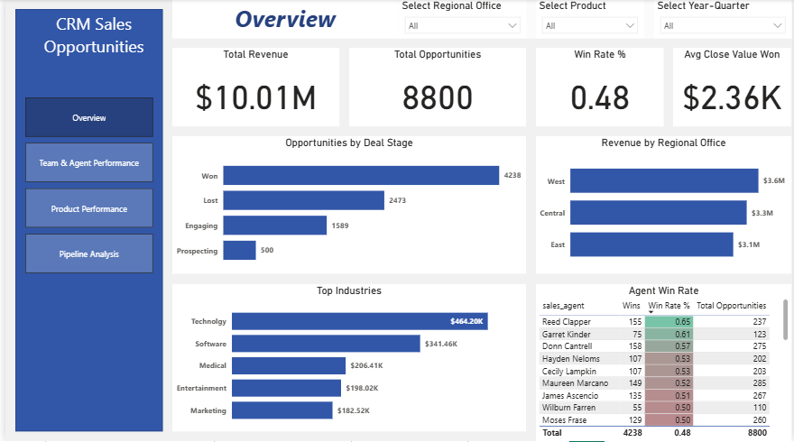
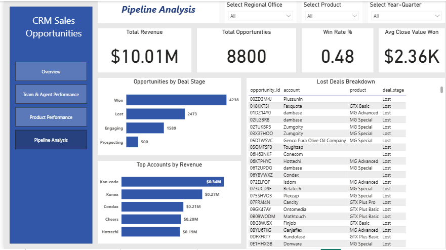
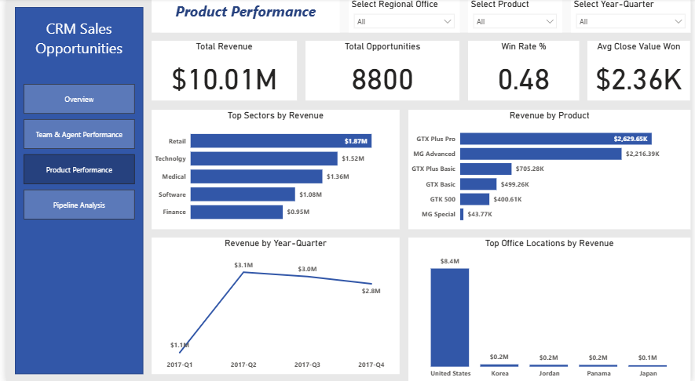
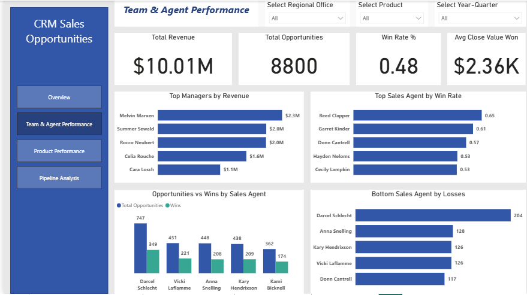

# CRM Sales Opportunities Analysis

Identifying Revenue Drivers and Pipeline Bottlenecks.

---

## 📊 Project Overview
Analysis of 8,800+ sales opportunities across 35 sales agents, 3 regions, and 7 product lines to identify what drives revenue and where deals are being lost.

Dataset: Maven Analytics CRM Sales Opportunities   
Time Period: 2017 (Q1-Q4)  
Key Metric: $10.01M total revenue analyzed

## 📌 Business Problem
The sales team is closing deals but win rates vary dramatically by agent (41%-65%).
Leadership needs to understand:
- Which agents/teams are most effective?
- Where is the pipeline leaking?
- Which products and sectors drive the most revenue?
- How to optimize opportunity allocation?
---

## 🛠️ Tools and Techniques
- **Power BI**: Data modeling, DAX measures, interactive dashboards
- **Power Query**: Data Cleaning, transformation, and preparation  
- **Analysis Methods**: Win rate analysis, pipeline stage analysis, cohort comparison
- **Visualization**: Multi-page interactive dashboard with drill-through capabilities

---

## 📈 Key Findings
**1. Regional Performance Disparity**
- **West Region:** $3.6M revenue (28.5% of total) - Top performer
- **Central Region:** $3.3M revenue
- **East Region:** Underperforming with only $3.1M
---
## 📸 Dashboard Preview
## 1️⃣ Overview Page

## 2️⃣ Pipelines Analysis

## 3️⃣ Product Performance

## 4️⃣ Team and Agent Performance

---
**2. Agent Performance Gaps**  
- **Top Agent(Reed Clapper):** 65% win rate  
- **Bottom Agent(Lajuana Vencill):** 41% win rate  
- **24% performance gap** between top and bottom performers  
- **Darcel Schlecht:** Received most opportunities (412) but lost 204 deals - allocation inefficiency  
  
**3. Manager Effectiveness**
- **Melvin Marxen:** Generated $2.3M (highest manager revenue)
- Top managers demonstrate clear coaching impact on team win rates

**4. Product Revenue Distribution**
- **GTX Plus Pro:** $2.63M (21% of revenue) - Star product
- **GTX Basic:** Consistent performer across all regions
- Product mix optimization opportunity exists

**5. Sector Analysis**
- **Retail Sector:** $1.87M - Strongest vertical
- **Employment Sector:** $436K - Weakest vertical (76% less than retail)
- Clear sector targeting needed

**6. Critical Pipeline Leakage**
- **2,473 deals lost at "Lost" stage** - biggest pipeline weakness
- Revenue peaked Q2 2017 ($3.09M) then declined 18% by Q4
- **Engaging -> Prospecting stage:** Another drop-off point

---

## 💡 Strategic Recommendations

### **Immediate Actions (This Quarter) - Highest ROI**
**1. Optimize Opportunity Allocation:** Reassign 30% of opportunities from lower-conversion agents (50% win rate) to top performers (65%)  
**2. Targeted Coaching for Bottom 5 Agents:** Improve average win rate from 45% to 52% through structured weekly coaching  
**3. Reduce “Lost” Stage Leakage:** 2,473 deals lost (28% of total). Conduct rapid loss-reason analysis and introduce earlier qualification controls.  
### **Medium-Term (3-6 Months) - Strategic Growth**
**4. Prioritize Retail Sector:** Retail generates 4.3× more revenue than Employment. Reallocate 20% of Employment marketing spend to Retail.  
**5. Expand GTX Plus Pro Penetration:** Increase attach rate from 35% → 50% through bundling and sales training  
**6. Investigate Q2-Q4 Revenue Decline:** Revenue dropped 18% from Q2 peak. Investigate pipeline velocity and seasonality drivers.  
### **Long-Term (6-12 Months)- Competitve Advantage**
**7. Implement Predictive Deal Scoring:** Flag high-risk deals earlier using stage duration, agent history, and sector data.  
**8. Align Regional Performance:** Document and replicate West region sales practices (prospecting methods, deal qualification, product mix strategy) across Central and East  

---

## 📊 Files Included
- [CRM Sales Dashboard.pbix](https://github.com/Ebun-nofiu/crm-dashboard-project/raw/refs/heads/main/CRM%20Dashboard.pbix) – Full Power BI analysis & dashboard  
- [CRM Sales Opportunities Analysis.pptx](https://github.com/Ebun-nofiu/crm-dashboard-project/raw/refs/heads/main/CRM%20SALES%20OPPORTUNITIES%20ANALYSIS.pptx) – Presentation slides  
- [CRM Sales Opportunities Documentation.docx](https://github.com/Ebun-nofiu/crm-dashboard-project/raw/refs/heads/main/CRM%20SALES%20OPPORTUNITIES%20DOCUMENTATION.docx) – Full project write-up  
